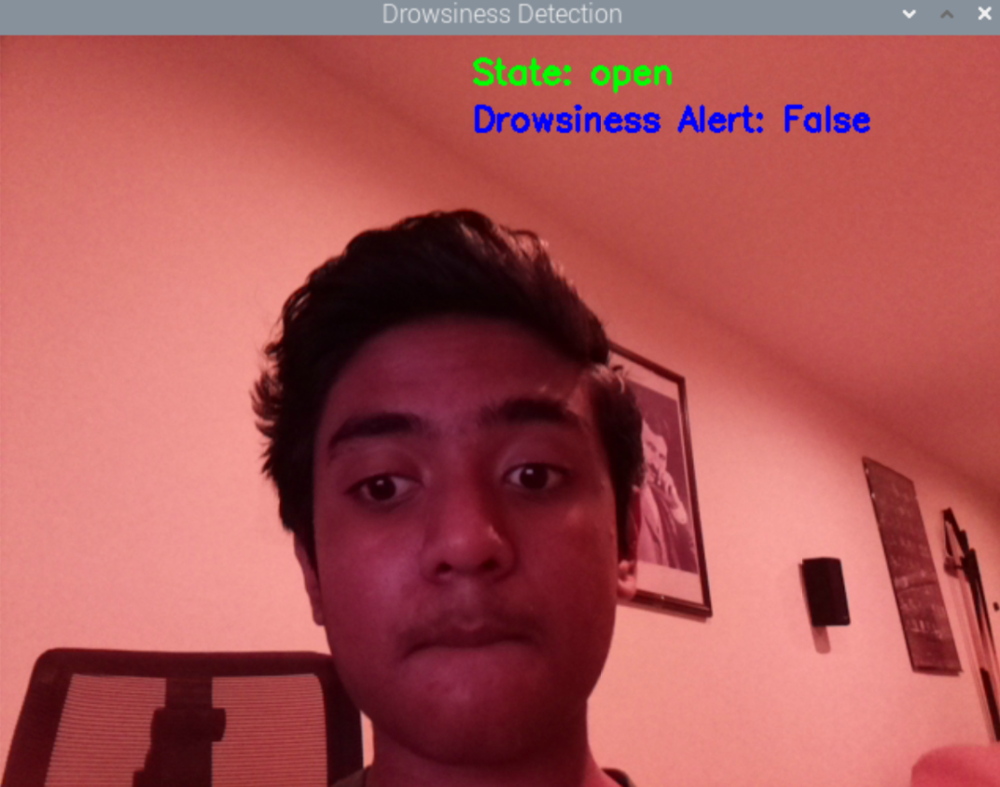
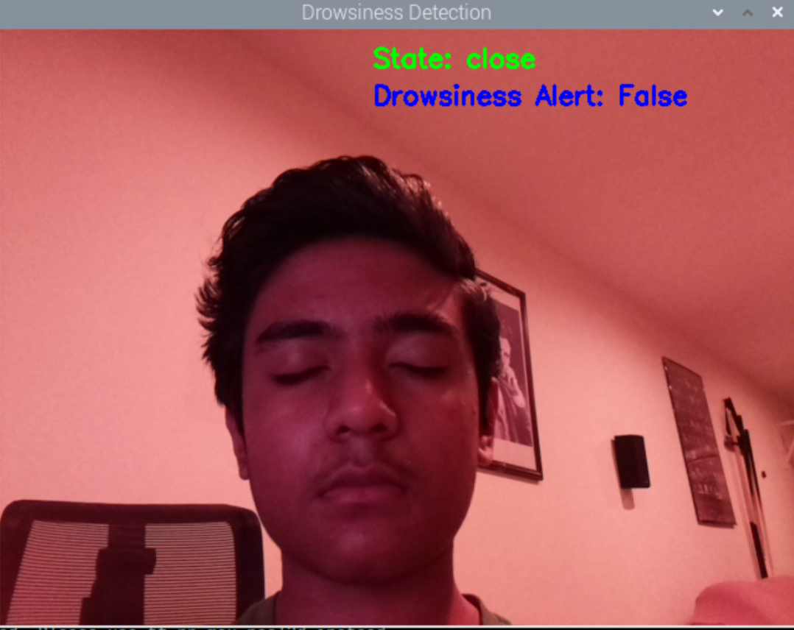
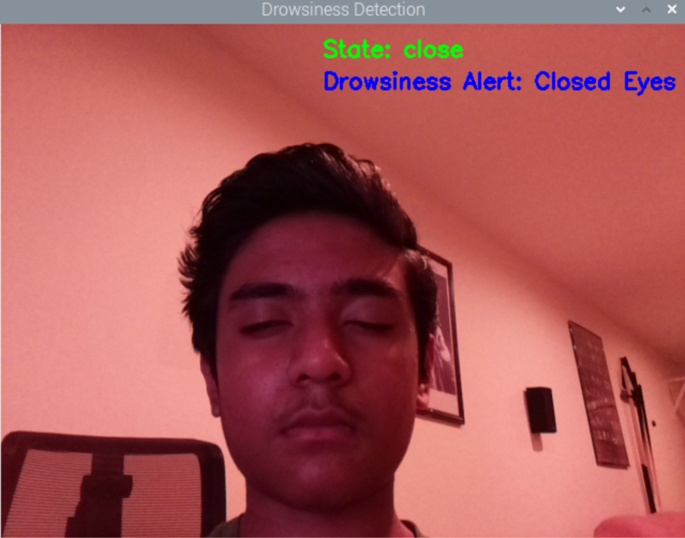

# Drowsiness Detection
Detects if a person is "Drowsy" by using a Keras CNN Image Classifier that I trained. This project was made to learn how CNN's work, how to train your own CNN Classifier, and how to implement your CNN Classifier in real time using Computer Vision.

## Getting Started:

### Prerequisites:
These are the packages you will need to install for Python3 for the Detector to work (I used the Anaconda Installer).
- Tensorflow
- Keras
- OpenCV
- Dlib
- Numpy & Scipy
- Imutils

### Clone the Repository:
Use this command to clone the repository.
```
git clone https://github.com/srinisriram/Drowsiness-Detection.git
```
### Run the Code:
Here is how you can run the Drowsiness Detector on your computer.
1. cd Drowsiness-Detection/detector
2. python3 Drowsiness_Detector.py

Here are some images of the detector running (I ran on a Raspberry Pi 4).

Here we see that in the top right corner we have two pieces of text. "State" and "Drowsiness Alert". "State" means the state of the eyes at the current moment. Right now, the eyes are open, so next to "State" shows "Open". "Drowsiness Alert" is the Drowsiness Alert, right now it says "False" which means there is no Drowsiness Alert.

Here, the eyes are closed, so next to "State", it says "Close". However, in this image, I just closed my eyes. That does not mean I am drowsy, as it is only 1 frame. So that is why the "Drowsiness Alert" is still False. 

At this time, I have closed my eyes and have kept them closed for quite some time. So now, along with the "State" being "Close", it says "Drowsiness Alert: Closed Eyes". This means that my eyes have been closed for more than 50 frames (threshold for consecutive closed eye frames), so the Drowsiness Alert will pop up.

Now you have ran the code!


## Understanding the Code:

If you want to understand the code, you can read each of the files that are provided in the "detector" folder. I have added docstrings and comments to make the code understandable.


## How I trained the model:

The dataset I used to train the model was the Closed Eyes in the Wild dataset. Here is the link: http://parnec.nuaa.edu.cn/xtan/data/ClosedEyeDatabases.html

To build the CNN, I used this code:
```
model = Sequential()
model.add(Conv2D(32, (3,3), padding = ‘same’,
 input_shape=(height,width,1)))
 model.add(Activation(‘relu’))
 model.add(MaxPooling2D(pool_size=(2,2)))
 model.add(Conv2D(64, (2,2), padding= ‘same’))
 model.add(Activation(‘relu’))
 model.add(MaxPooling2D(pool_size=(2, 2)))
 model.add(Conv2D(128, (2,2), padding=’same’))
 model.add(Activation(‘relu’))
 model.add(MaxPooling2D(pool_size=(2, 2)))
 model.add(Dropout(0.25))
model.add(Flatten())
 model.add(Dense(512))
 model.add(Activation(‘relu’))
 model.add(Dense(512))
 model.add(Activation(‘relu’))
 model.add(Dense(1))
 model.add(Activation(‘sigmoid’))
model.compile(optimizer=Adam(lr=0.001), 
 loss=’binary_crossentropy’,
 metrics=[‘accuracy’])
```

To train the CNN, I used this code:

```
model.fit_generator(train_dir,batch_size=32),
 steps_per_epoch=8000, epochs=50)
```


